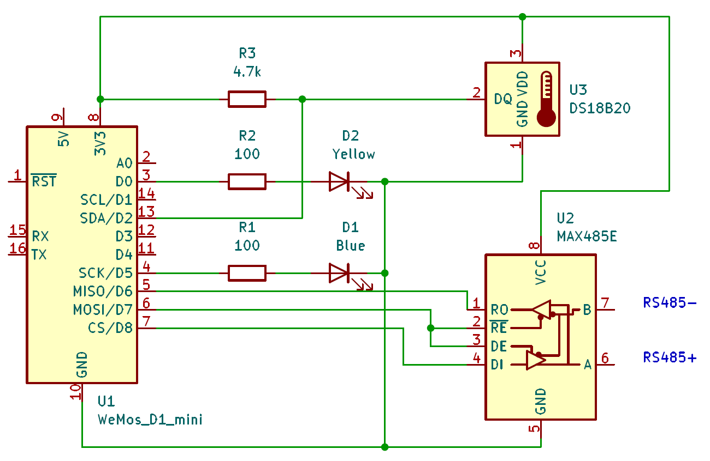
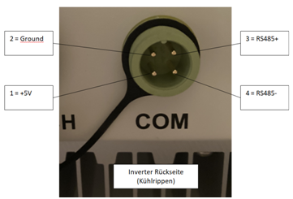
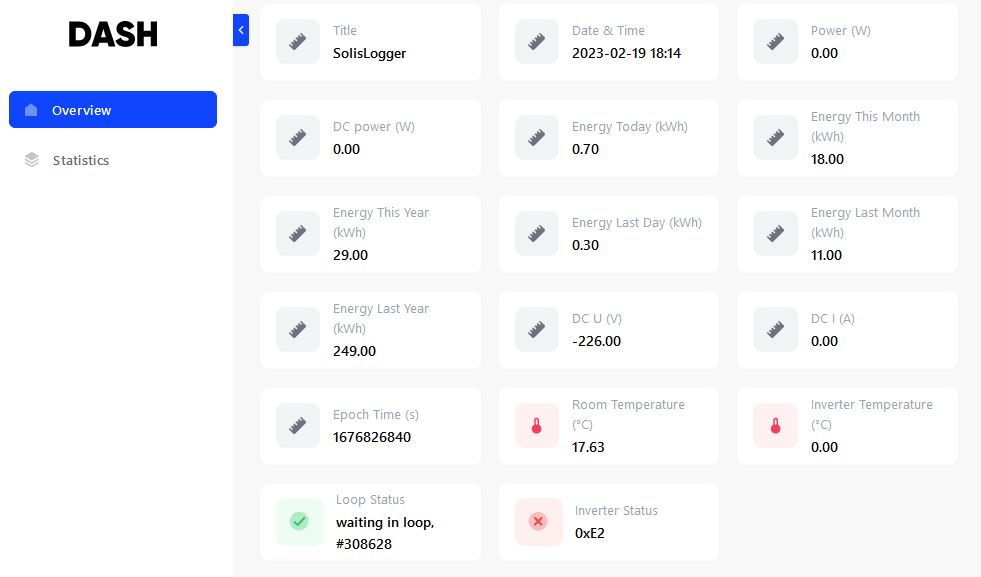

# SolisLogger
ESP8266 based data logger to read Solis inverter data via Modbus and transfer it to Volkszaehler Middleware.

## Features

SolisLogger evaluates Solis Inverter via ModBus RS485 interface and transfers data to Volkszaehler Middlerware by http.  
Optionally, a temperature sensor DS18B20 connected by Onewire bus can be evaluated.  
A webserver dashboard is available to show inverter data, temperature, time (also in UNIX epoch time seconds), status.  
A configuration web interface is available to set web credentials and Volkszaehler channel UUIDs.  

## Hardware ##
The target hardware is an Expressif ESP8266 microprocessor with a RS485 circuit to connect the Solis Inverter ModBus COM interface.  
Optionally, a DS18B20 temperature sensor connected via Onewire Bus and two status LEDs (yelow, blue) can be added.  
Connection PINs are defined in config.h

Note: set in config.h
- DS18B20 false, if there is no temperature sensor connected.
- LED_USE false, if there are no external LEDs connected.

### Layout


### Solis inverter socket
The RS485 ModBus is available at the COM port of the Solis inverter. The pinout of the Solis S6 Mini inverter is shown below. Please check if the pinout is different when using with another version of the inverter.
A suitable plug type is Exceedconn EC04681-2014-BF.  



### Dash Board

Note: Inverter Status 0xE2 means the inverter is not reachable (because of switch-off at darkness).

## Description ##
On boot, the device provides a local internet access point at http://192.168.4.1/config to connect for configuration.
The initial (default) password is defined in config.h.  
After configuration or a 30sec timeout, the device connects to a local WiFi and provides a small home page at *\<localIP\>/start* 
to access the Dash Board, the configuration page and to reset the device.  

After setup of the software, the device periodically
- collects the temperature of the DS18B20 and the Solis Inverter data (connected via RS485 ModBus),
- updates the dash board at *\<localIP\>/*,
- sends the data to the Volkszaehler middleware/data base.
Periods of the data collection are defined by *DS18B20_READ_INTERVAL, INVERTER_READ_INTERVAL_FREQUENT, INVERTER_READ_INTERVAL_SELDOM*.

### LEDs ##
The build-in LED and the external yellow and blue LED indicate the processing mode.

| Build-in | Yellow | Blue | mode                                          |
|:--------:|:------:|:----:|:-----------------------------------------------|
|   ON     |  OFF   | OFF  | setup(): init config parameter                 |
|   OFF    |  OFF   | OFF  | setup(): init web interface, devices           |
|   ON     |  ON    | OFF  | setup(): during read inverter data             |
|   ON     |  OFF   | OFF  | at end of setup()                              |
|   ON     |  OFF   | OFF  | entry into loop()                              |
|   ON     |  OFF   | OFF  | when wifiConnected()                           |
|   ON     |        | OFF  | during access to the Solis Inverter            |
|          |  ON    | OFF  | http publish of inverter data                  |
|   OFF    |  OFF   | ON   | read DS18B20 temperature sensor                |
|   OFF    |  ON    | ON   | inverter not accessible during publish          |
|   OFF    |  ON    | ON   | start reset()                                  |
|   OFF    |  OFF   | OFF  | in loop(): wait for next trigger               |

LED_BLUE and LED_YELLOW define the PIN of the LEDs in config.h


## Configuration

### Web Interface
The program provides a Web Interface for configuration and a small home page.

### Web Access Point (WiFI AP mode)
The program provides a Web Access Point at boot time via http://192.168.4.1/config (or the configured SSID name) using the configured password.  
Note: http://192.168.4.1 will access the Dash Board, not the config page.  
It offers a configuration page both for the Access Point and for a local WLAN SSID name and password.  
Additional customer parameters are supported.  
Configuration is stored in EEPROM.  

At first boot, the defined default password *MY_WIFI_AP_DEFAULT_PASSWORD* (as defined in *config.h*) is used for AP mode access.  
Note: at first boot you need to configure the device: set a new AP password, the WLAN SSID and WLAN password, and push the apply button.
**Disconnect** from the the Access Point to continue and **reset** the device.

If no client connects before the timeout (configured to 30sec), the device will automatically continue in 
STA (station) mode and connect to a local WLAN if configured.

### Web Interface in a local WLAN (WiFi STA mode)
If the device has already been configured, it will automatically connect to the local WiFi after timeout.  
The device web interface can be reached via the IP address obtained from your local network's DHCP server or the configured SSID name.  
A small home page is provided at *\<localIP\>/start* which offers access to the configuration page as well.  
To login into configuration, provide the user *admin* and the configured AP *password*.

### Configuration Parameter
The configuration page provides two sections:
- System Configuration: WiFi AP/STA names and passwords
- VZ Settings: Volkszaehler server name (or IP), volkszaehler middleware (e.g. middleware.php), UUID of selected data channels (including a channel for test data and a heart beat channel) and a time zone offset.  
You can switch-off transmission of data by using "null" as UUID (configurable by VZ_UUID_NO_SEND in config.h).  
Note: SolisLogger will send data with standard UNIX epoch time (ms) timestamps (ignoring time zone offset).

## Usage
- Just switch on the board.
- Connect to the access point if you need to configure your local WiFi net:  
IP address 192.168.4.1 (or the specified network name) e.g. using a mobile phone or tablet
with your configured AP password. This needs to be done at first boot.
- A "force-to-AP" mode is provided in case of forgotten password:  
Connect *WEBCONF_AP_MODE_CONFIG_PIN* (preset is pin D3) to ground and use *MY_WIFI_AP_DEFAULT_PASSWORD*.  
- Wait for AP timeout and access the home page in your local network:  
accessible by the WLAN SSID (or IP address provided by your DHCP server).
- You can access the configuration page in STA mode by login as *admin* with the configured AP password.


## Implementation Details ##

### Build
Visual Studio Code and platformio are recommended as development platform.  
Using the provided platformio.ini file, the required libraries are automatically downloaded from git.  
Adapt the parameters in *config.h* according to your needs.  
Especially, define the configuration parameters for channel UUIDs because these are used as default values and will save some typing effort in the configuration UI.  
Build and download the firmware to the target hardware.


### Used classes ###
- *myTicker*    implements an SW operating system time ticker to trigger data read out [1]
- *vzHttp*      transfers data to Volkszaehler data base through middleware.php (based on example in [4])
- *LED*         controls LEDs (modified version of [1])
- *myDS18B20*   access to DS18B20 temperature sensor (modified version of [1])
- *modbus*      access to the modbus interface of the inverter (modified version of [1])
- *ESPDash*		provides a dash board according to [3]
- *confWeb*		configurable web interface with asynchronous server (derived from [2] with major changes)

### Private Libraries ###
  confWeb  

### Public Libraries ###
  https://github.com/ayushsharma82/ESP-DASH.git @ 4.0.1  
  https://github.com/4-20ma/ModbusMaster.git  
  https://github.com/me-no-dev/ESPAsyncTCP.git  
  https://github.com/me-no-dev/ESPAsyncWebServer.git  
  https://github.com/bblanchon/ArduinoJson.git  
  https://github.com/PaulStoffregen/Time.git  
  https://github.com/PaulStoffregen/OneWire.git  
  
### Dependency Graph ###
``` bash
Dependency Graph
|-- ModbusMaster @ 2.0.1+sha.3a05ff8
|-- ESP-DASH @ 4.0.1+sha.9431138
|   |-- ESP Async WebServer @ 1.2.3+sha.f71e3d4
|   |   |-- ESPAsyncTCP @ 1.2.2+sha.1547686
|   |   |-- Hash @ 1.0
|   |   |-- ESP8266WiFi @ 1.0
|   |-- ArduinoJson @ 6.20.1+sha.42ae8c3
|   |-- ESP8266WiFi @ 1.0
|   |-- ESPAsyncTCP @ 1.2.2+sha.1547686
|   |-- Hash @ 1.0
|-- ESPAsyncTCP @ 1.2.2+sha.1547686
|-- ESP Async WebServer @ 1.2.3+sha.f71e3d4
|   |-- ESPAsyncTCP @ 1.2.2+sha.1547686
|   |-- Hash @ 1.0
|   |-- ESP8266WiFi @ 1.0
|-- ArduinoJson @ 6.20.1+sha.42ae8c3
|-- Time @ 1.6.1+sha.a18e50d
|-- OneWire @ 2.3.7+sha.386a8d0
|-- confWeb @ 1.0.0
|   |-- ESP Async WebServer @ 1.2.3+sha.f71e3d4
|   |   |-- ESPAsyncTCP @ 1.2.2+sha.1547686
|   |   |-- Hash @ 1.0
|   |   |-- ESP8266WiFi @ 1.0
|   |-- ArduinoJson @ 6.20.1+sha.42ae8c3
|   |-- EEPROM @ 1.0
|   |-- ESP8266WiFi @ 1.0
|   |-- ESPAsyncTCP @ 1.2.2+sha.1547686
|   |-- Hash @ 1.0
|   |-- DNSServer @ 1.1.1
|   |   |-- ESP8266WiFi @ 1.0
|-- Ticker @ 1.0
|-- DNSServer @ 1.1.1
|   |-- ESP8266WiFi @ 1.0
|-- ESP8266WiFi @ 1.0
|-- EEPROM @ 1.0
|-- Hash @ 1.0
|-- EspSoftwareSerial @ 7.0.0
|-- ESP8266HTTPClient @ 1.2
|   |-- ESP8266WiFi @ 1.0
```

# License
Copyright (C) M. Herbert, 2022-2023.  
Licensed under the GNU General Public License v3.0

# Acknowledgement
This project is based on the hardware layout and code of https://github.com/10k-resistor/Solis4Gmini-logger for the Solis inverter ModBus interface and the Onewire interface of the temperature sensor.  
The configuration interface was developed using https://github.com/prampec/IotWebConf. Major re-work was done for compatibility with the AsyncWebServer used by ESP-Dash.

# History
see [CHANGELOG.md](http://./CHANGELOG.md)

# References
[1] https://github.com/10k-resistor/Solis4Gmini-logger  
[2] https://github.com/prampec/IotWebConf  
[3] https://github.com/ayushsharma82/ESP-DASH  
[4] https://RandomNerdTutorials.com/esp8266-nodemcu-http-get-post-arduino/
